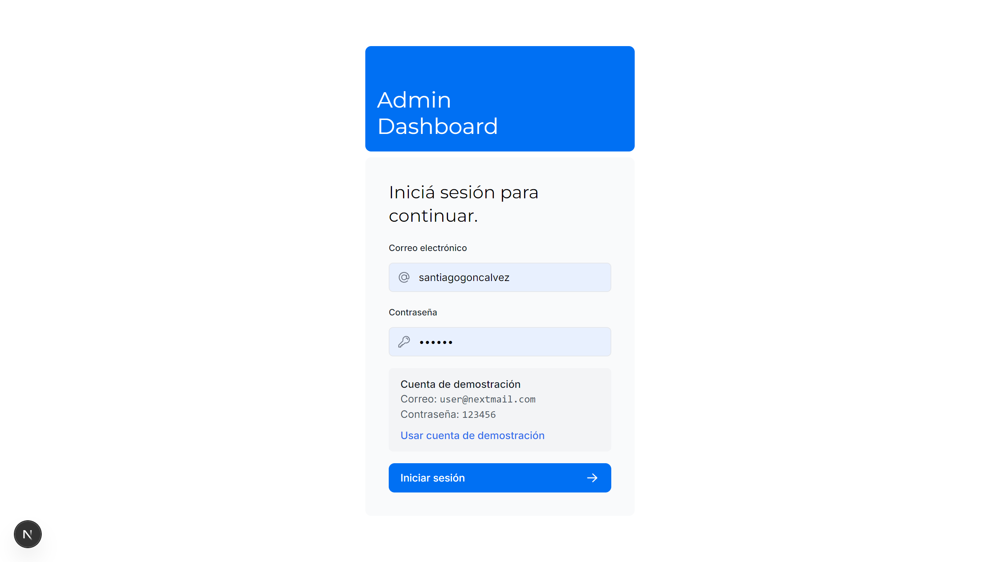
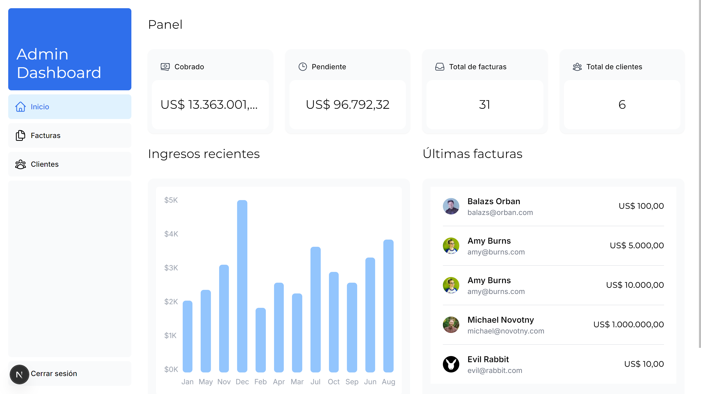

# 🚀 Admin Dashboard

Panel de administración full-stack construido con Next.js (App Router), TypeScript, Tailwind CSS, PostgreSQL y NextAuth.

🌐 **Demo:** https://admindashboard.santiagogoncalvez.com

---

## 📸 Capturas

### Login



### Dashboard



---

## 🛠️ Tecnologías

- **Framework:** Next.js (App Router)
- **Lenguaje:** TypeScript
- **Estilos:** Tailwind CSS & `clsx`
- **Base de datos:** PostgreSQL (vía `postgres`, SSL requerido)
- **Autenticación:** NextAuth.js (v15 beta, config separada Edge/Node)
- **Validación:** Zod
- **Iconografía:** Heroicons & Lucide

## ✨ Características

- Rutas protegidas con middleware (sesión evaluada antes del render).
- Server Actions para mutaciones seguras (crear/editar/eliminar facturas).
- Validación de formularios en servidor con Zod.
- Streaming con `loading.tsx` y `<Suspense>` + skeletons.
- Búsqueda y paginación optimizadas con parámetros de URL y debounce.
- Búsqueda responsive: tabla en desktop, cards en mobile.
- Favicon propio y textos de la interfaz en español.

## 📁 Secciones

- `/` — Home pública con hero responsive.
- `/login` — Acceso con feedback visual y cuenta demo.
- `/dashboard` — Métricas generales, gráfico de ingresos y últimas facturas.
- `/dashboard/invoices` — CRUD de facturas con búsqueda y paginación.
- `/dashboard/customers` — Listado de clientes con búsqueda.

## 💻 Correr en local

```bash
npm install
# crear .env con POSTGRES_URL y AUTH_SECRET
npm run dev
```

---

> Este proyecto partió del dashboard de ejemplo de *Next.js Learn* y fue personalizado: branding y favicon propios, interfaz en español, ajustes de responsive, y despliegue propio.
